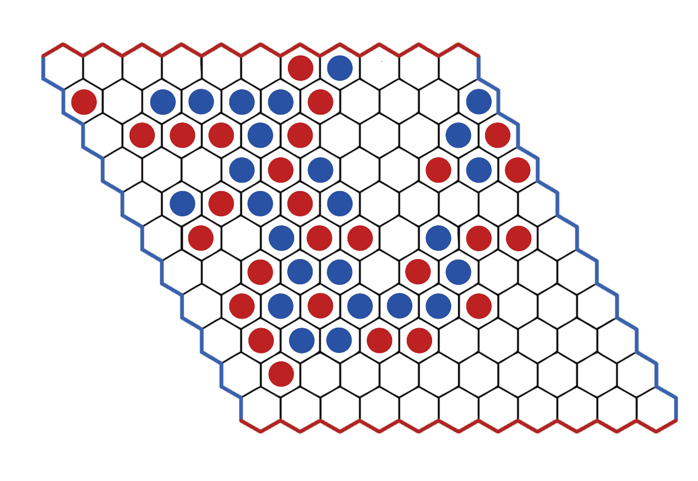

# myHex

## Aim: Simulate Hex game 
## TechStack: AI, Python, pygame

## Hex Game

-> Hex is a two player abstract strategy board game in which players attempt to connect opposite sides of a rhombus-shaped hex board. 
-> Hex is played on a board made of hexagons. The same board is shaped like a rhombus, as shown in the picture. The pieces are placed in the hexagons of the board. The board shown here has 11 tiles on each side of the diamond, which is a common size for experienced players, but the game can be played on any size board.

## Rules
-> Initially the board is empty.
-> Each player is assigned a color of tiles and two opposite sides of the board that they will have to try to connect with their tiles following the rules of the game.
-> The players take turns placing chips on the board in unoccupied squares.
-> The first player who manages to form a line of his pieces that connects his two sides wins.

## Target
The objective is to make a path with the pieces of your color between opposite sides (of the same color) of the board. The opposing player will try to make a chain between the sides of the other color of the board. The chain does not have to be in a straight line, as long as the chain is closed, that is, the chips are directly next to each other. In the game shown below, blue won.

## Minimax Algorithm

-> Minimax is a recursive algorithm which is used to choose an optimal move for a player assuming the opponent will also play optimally. As the name suggests, our goal is to minimize maximum loss (minimize worst-case scenario).

-> A minimax search is a deep exhaustive search of a game tree that returns a score value. A minimax search has two phases called the maximize phase and minimize phase, respectively. The maximization phase occurs in all positions on the board where the first player has a turn and the minimization phase occurs in all positions on the board where the second player has a turn. The maximization phase returns the highest score assigned to the successors while the minimization phase returns the smallest value assigned to the successors.

## α-β Pruning

-> The idea behind this simple minimax improvement is that we can reduce the number of branches evaluated.

-> Searching for the complete tree creates a player who never loses because he knows all the possible outcomes in full. But unlike the Tic Tac Toe which is a small board, displaying all its plays is not difficult on a computer machine. But for a game like Hex it is normally played on 11x11 boards, which is not an option. So we add a pruning to reduce the number of nodes searched, without affecting its optimality.

->The α-β pruning algorithm is an extension of the minimax search that has two values alpha and beta that bind the score at each node or game state. The value of alpha is the lowest value bound to the node which is maximized in the search while beta is the highest and is minimized in the search.

## Heuristic
I have used heuristic score as the difference in path length of players where path length is the minimum number of moves to be made by the player so as to win (not accounting for the moves of the adversary).

## Implementation
Hex Game Board

Game won by AI!!!

